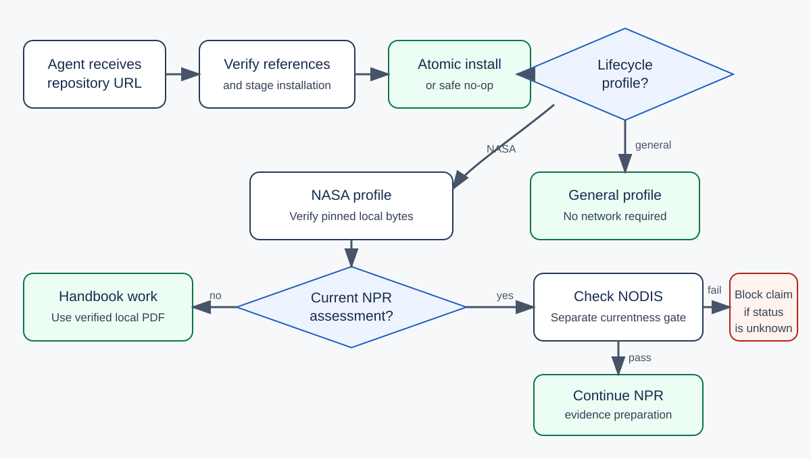

# Write Verifiable Requirements

`write-verifiable-requirements` is a Codex skill for requirements engineering.
It helps agents write, rewrite, review, validate, and trace requirements without
hiding ambiguity or inventing approval.

The skill supports:

- clear `shall` requirements;
- RFC 2119 and RFC 8174 BCP 14 specifications;
- general requirements-quality reviews;
- NASA Systems Engineering Handbook requirements-lifecycle work;
- NPR 7123.1D evidence preparation;
- verification, validation, traceability, baseline, and change records.

It does not claim that automated checks prove technical correctness, safety,
completeness, feasibility, or organizational compliance.



## Agent installation

Give the repository URL to an agent and ask it to install the skill. The agent
must run the repository installer:

```shell
git clone https://github.com/GhostlyGawd/write-verifiable-requirements.git
cd write-verifiable-requirements
python scripts/install_skill.py
```

The command verifies the bundled references, stages the complete skill, and
replaces an existing installation atomically. A failed replacement restores
the last valid installation.

Codex's standard skill installer does not run repository post-install hooks.
If an agent uses that installer, it must still run the verification command
inside the installed skill:

```shell
python scripts/manage_references.py status
```

The repository installer is the supported complete installation path.

The verified runtime uses Python 3.12 and requires PyYAML 6.x. Clean
environments and CI install the hash-pinned PyYAML 6.0.2 dependency:

```shell
python -m pip install --require-hashes -r requirements.txt
```

## When Codex uses the skill

Codex can activate the skill for requests that concern:

- requirements engineering or a requirements specification;
- requirements rewriting, review, validation, or traceability;
- acceptance criteria and objective verification;
- NASA requirements-lifecycle work;
- NASA-style `shall` requirements;
- NPR 7123.1 evidence preparation;
- RFC 2119 or RFC 8174 normative language.

The skill does not activate only because a user asks for concise or clear
writing.

## Agent workflow

The agent selects a language profile and a lifecycle profile independently.

| Profile | Purpose | Network requirement |
|---|---|---|
| `general` | Core requirements quality and release gates | None |
| `nasa-se-handbook-rev2` | Review against mapped handbook guidance | None after installation |
| `nasa-npr-7123.1d` | Prepare applicable process evidence | Live NODIS status check before a current-NPR claim |

Normal writing and review use the verified local references. Ordinary skill
execution does not access the network.

For a current NPR assessment, the agent runs:

```shell
python scripts/manage_references.py check-current
```

If a bundled reference is missing or corrupt, the affected NASA profile stops.
The general profile remains available. The agent can run this explicit repair:

```shell
python scripts/manage_references.py repair
```

Repair downloads only manifest-approved bytes from listed NASA HTTPS hosts. It
checks the exact size, PDF signature, and SHA-256 digest before atomic
installation. It never accepts a new digest automatically.

## Example

Ask Codex:

> Review these requirements for ambiguity, atomicity, source traceability, and
> objective verification. Use the general lifecycle profile and `shall`
> language. Do not resolve missing product decisions.

The agent returns findings, proposed corrections, unresolved decisions, and
release status. Clean output remains blocked until the required evidence,
human reviews, and baseline approval exist.

## Repository layout

```text
write-verifiable-requirements/
├── scripts/install_skill.py
├── tests/
├── docs/
└── write-verifiable-requirements/
    ├── SKILL.md
    ├── agents/openai.yaml
    ├── references/
    └── scripts/
```

See [SECURITY.md](SECURITY.md) for network and trust boundaries,
[NOTICE.md](NOTICE.md) for NASA reference provenance, and
[CONTRIBUTING.md](CONTRIBUTING.md) for reference-update controls.

## Status and limitations

- The automated checker validates structure and selected patterns.
- Human reviewers remain responsible for meaning, feasibility, safety,
  completeness, interfaces, conflicts, verification adequacy, and approval.
- The handbook profile applies reviewed guidance. It is not a NASA compliance
  certification.
- The NPR profile cannot establish organizational compliance. Applicability,
  current authority, tailoring, waivers, deviations, the complete compliance
  matrix, SEMP evidence, and authorized decisions remain separate.
- This project is independent. NASA has not approved, sponsored, certified, or
  endorsed it.
- The repository currently grants no software license. Public visibility alone
  does not grant permission to copy, modify, or redistribute the source code.
